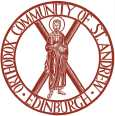

  

<h1 align="center">Edinburgh Orthodox Website</h1>

  <em>A project board for the redesign of the website of the Orthodox Community of St Andrew, Edinburgh.</em>

  <a
    href="https://oliverbrotchie.github.io/edinburgh-orthodox.org.uk/mockups/"
  >🎨 View the redesign mockup</a>
  &nbsp;·&nbsp;
  <a href="https://edinburgh-orthodox.org.uk" target="_blank">🌐 Current live site</a>
  &nbsp;·&nbsp;
  <a href="https://github.com/OliverBrotchie/edinburgh-orthodox.org.uk/issues">🕯️ Issue tracker</a>

## Welcome

☦️ *A parish in the Archdiocese of Thyateira and Great Britain, worshipping in Edinburgh
since 1948.*

This repository does **not** hold the site itself — the site runs on WordPress.com and is
edited in the WordPress admin. This repo is the home of the plan: the proposal, the spec,
the tickets, and the visual mockups that show how the redesign will look.

<table>
  <tr>
    <td align="center" padding="16"><h3>📜 Read the plan</h3>The full redesign, in plain English. <code>proposal.md</code></td>
    <td align="center"><h3>🧾 Work the spec</h3>Every need and decision, ready to split into tickets. <code>docs/spec-website-redesign.md</code></td>
    <td align="center"><h3>🎨 See the mockups</h3>Plain HTML/CSS you can open in any browser, now on GitHub Pages. <code>mockups/</code></td>
  </tr>
</table>

## The redesign at a glance

| ✨ Change | 📍 Where |
|-----------|----------|
| Live **services calendar** on the homepage, fed by Google Calendar | `mockups/index.html` |
| **Weekly announcements** block, editable by non-technical volunteers | `mockups/index.html` |
| **Wishlist** for furnishing the new church, via Square | `mockups/wishlist.html` |
| **FAQ** page grouped by topic | `mockups/faq.html` |
| Tidier **donations** page | `mockups/donations.html` |
| History moved off the homepage to its own page | `mockups/index.html` |

A full, item-by-item list of how the redesign differs from the current site is in
[`mockup-changes.md`](mockup-changes.md).

## Getting around

| Folder / file | What it is |
|---------------|------------|
| `proposal.md` | The working plan, plain English |
| `CONTEXT.md` | The shared vocabulary (churches, weekly cycle, content tiers) |
| `docs/spec-website-redesign.md` | The spec: needs, decisions, out-of-scope |
| `docs/adr/` | Architectural decision records |
| `mockups/` | The visual mockups (also on GitHub Pages) |
| `examples/` | Real example posts and the church-year calendar file |
| `mockup-changes.md` | Every styling change, compared to the live site |

## Start here

1. 🎨 **[Open the mockup](https://oliverbrotchie.github.io/edinburgh-orthodox.org.uk/mockups/)** to see the intended look.
2. 📜 Read [`proposal.md`](proposal.md) for the full plan.
3. 🧾 Read [`docs/spec-website-redesign.md`](docs/spec-website-redesign.md) for the detail.

  Orthodox Community of St Andrew, Edinburgh · Charity SC054378

