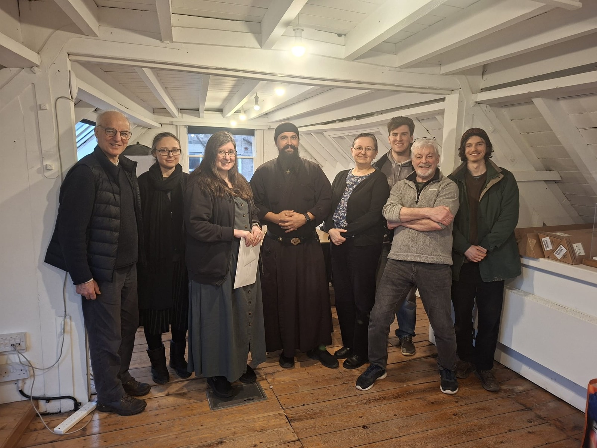
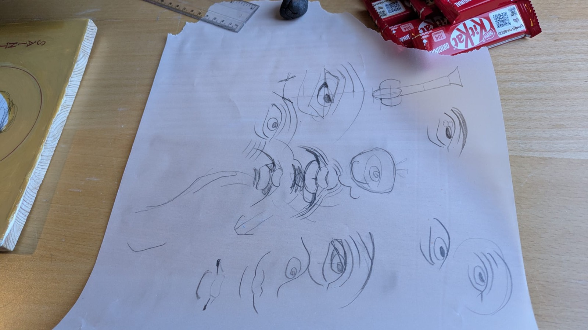
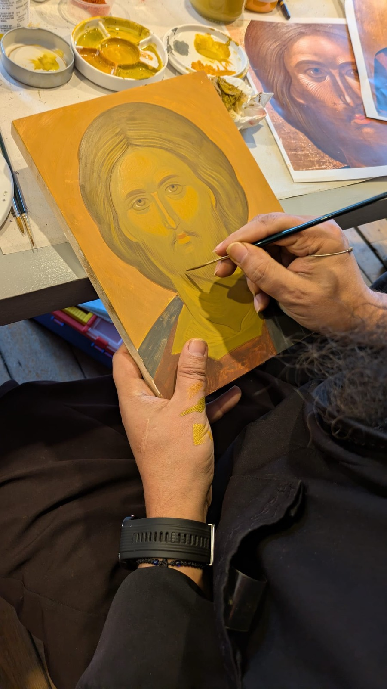
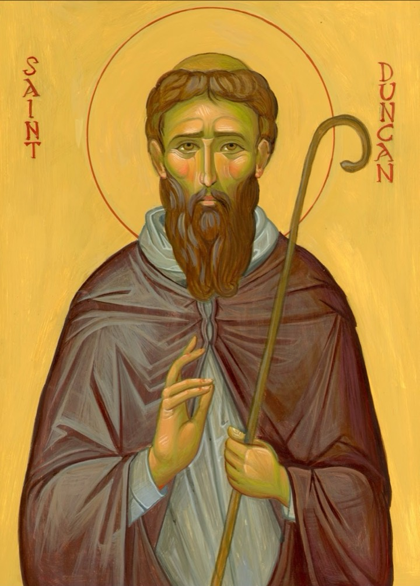
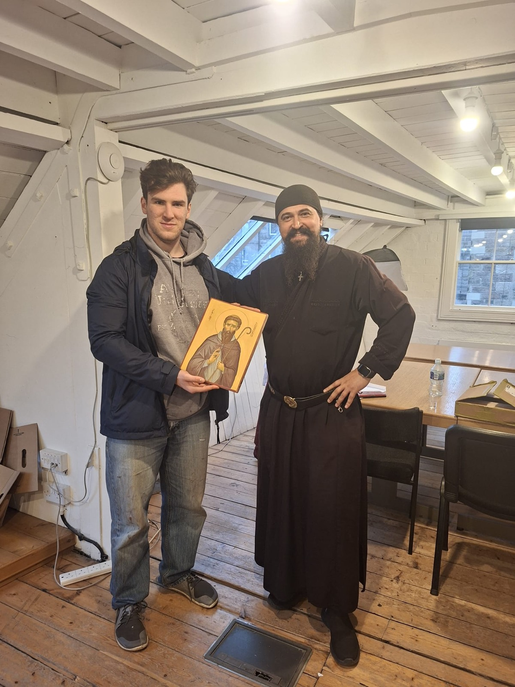
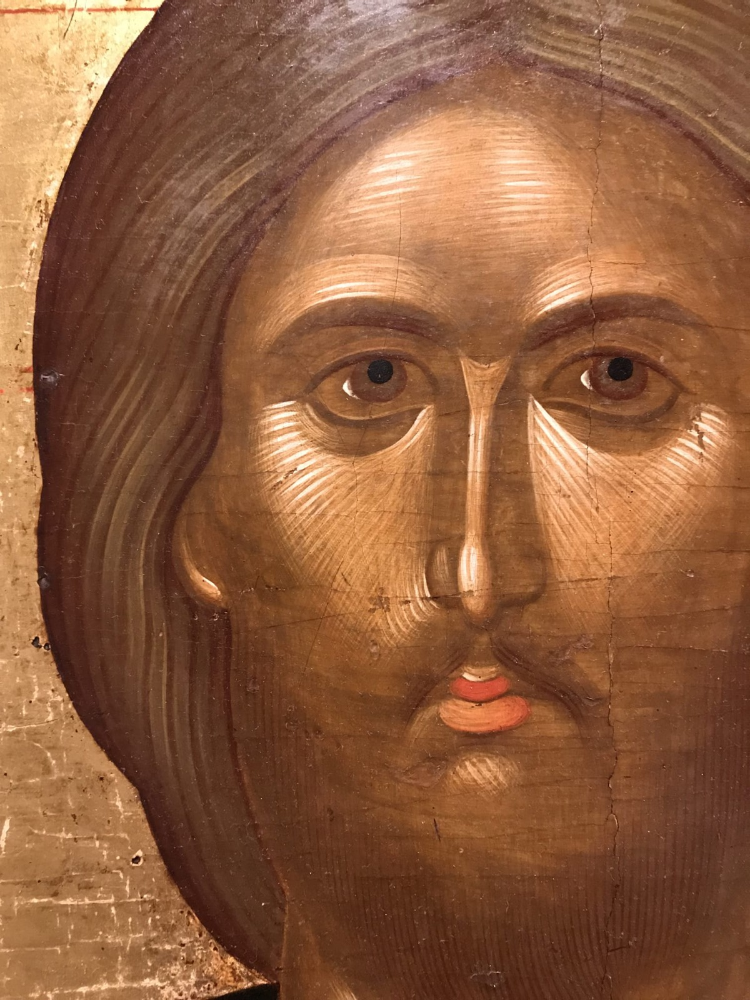

+++
title = "At the Easel of a Master"
date = 2026-02-22
description = "Reader Chad Sutherland-Lockhart reflects on six days learning Byzantine iconography from Father Ilie Bobaianu."
draft = false
+++

*By Reader Chad Sutherland-Lockhart*

This past Cheesefare Week, 16 to 21 February, we had the great blessing of welcoming Father Ilie Bobaianu for a week-long masterclass on Byzantine iconography.

Father Ilie is one of the most prominent iconographers of our time, so to learn from him was an incredible opportunity. A massive thank you also to Alina Garvis and Katherine Saunders. Alina organised the course and translated for Father Ilie, while Katherine provided the venue and was incredibly generous with her materials.

## Day 1

After a tentative start to the morning, with everyone shuffling in with their various materials and equipment, we had a quick introduction over tea and coffee. Afterwards we moved to the main workshop area, where we sat along the long table, with Father Ilie fittingly at the head and Alina beside him translating.

Father Ilie gave a quick introduction to his body of work: over 35 years of experience, a pivotal figure in the revival of traditional Orthodox iconography in Romania, and well known across the Orthodox world, especially on Mount Athos, which he has visited more than 300 times in the course of his research. He then turned to us, asking about our expectations and hopes for the course, and encouraged us to ask him questions throughout.

During this discussion Father Ilie revealed that he did not have a structured plan, and instead wanted to tailor the course to the participants. After assessing the group, he made the decision to focus on the face of one of his favourite icons: Christ Pantocrator from Timios Prodromos Monastery in Serres.

We each received a print of the icon, provided by Katherine, and Father Ilie encouraged us to use tracing paper to get the drawing correct before working from it. He then assessed our materials and stressed the importance of using the right ones. He took particular issue with acrylic gesso boards, calling them spongy and smudgy and saying they dull the pigments, and insisted that gesso should be traditionally made. He also discussed the need for natural hair brushes and correctly sourced pigments. He spent the rest of the day moving among the group, working on people's icons as an example for the rest of us.

## Day 2

One interesting thing I noted about his process is the fluidity between the stages: he does not necessarily work in a linear fashion. He also applied many layers of pure egg mix as a wash to help blend and seal the work as it progressed.

He then went over the major features of the face, explaining that the lips are like two beans and that the eye and brow area should, in its totality, appear like an apple.

Father Ilie is a relaxed character, telling dry jokes and flashing the occasional smile, but he is a true artisan and takes iconography extremely seriously. Later in the day he mentioned that much of his body of work is in fact the frescoes in his monastery's church, and that he feels he has not completed enough icons, since 25 of his 35 years as an iconographer were dedicated to that church.

## Day 3

By this point many of us were working on the first flesh of the icon, where you begin to see the distinction between the shadows and the lights of the face. Father Ilie used Cecilo's board as his example most often, spending a couple of hours working on it; Cecilo did not seem to mind, as it meant taking home an original by Father Ilie.

Personally, I was not working on the same icon as the rest of the group. That had the drawback that I could not follow Father's process as closely, but it had the benefit of his insight into hands and clothing. He made a particular point about using lights on clothing to create a more dynamic and interesting composition, saying that one side should be colder and the other warmer, and that one side should be brighter, building its shapes with second and third lights, while the other works more into the shadows. This is not a common technique, as many icons use more uniform light, but Father Ilie pointed out that it is a trait you see in truly masterful older iconography.

More of Father Ilie's quirks were on display, including his magnifying glasses, which he uses to get the fine details around the eyes and beard. He says they cost him only £5, and that he got them from China (Temu, perhaps?). Then there is his make-up pad, which he rests on his hand to avoid smudging an icon when he cannot use a proper easel.

## Day 4

Today began a long-form discussion of more in-depth details of Father Ilie's process, because some members of the course had to leave early. He detailed his gesso and gilding process, which differed in the main from the process I am used to.

He then discussed the pilgrimages he made across the Orthodox world after the fall of the communist government in Romania, and his many trips to the Holy Mountain. He also showed us photos from his youth before he became a monk, from his early time in the monastery, and from his travels around the world.

He then let us in on a secret that apparently none of the monks at his monastery know: his proficiency in classical guitar, which he played for us. It is not much of a secret if you know classical guitar, as he has very long fingernails on his right hand, while the nails of his left are well groomed. This led some members of the group to perform musical numbers of their own, much to Father Ilie's approval.

Father also discussed his philosophy of making everything in one's environment beautiful. He told a story from his monastery, where a banister was to be installed and he presented various ornate designs he had collected on his travels, especially from the Holy Mountain. He then lamented that they disregarded his ideas and installed a simple metal banister, like one you might find in a supermarket or a government building.

Many things Father Ilie says give you a strong sense that he is a true artist in his soul first, and a monk second. Still, at the end of this long discussion, he concluded that God will not judge him on his iconography, but on his conduct as a Christian, and on whether he has given peace to those around him.

## Day 5

Today Father Ilie went over colour mixing, and how he pre-mixes certain pigments he uses often, such as his usual skin tones. He used an interesting method of mixing pigments on a plate with a palette knife and a little water, to make a butter-like substance, which he would then set aside on the radiator to dry.

I found the skin pigments quite surprising: a lot of strong greens in the undertones and blended areas, a very strong peach for the lights of the face, and a bright cherry colour for the blush. I assumed the face would end up like a rainbow, or, as someone in the group put it, like a mandrill. But with enough blending, the seemingly extreme palette produced a harmonious result.

Father Ilie pushed me very hard on my icon, making me jump from one layer to another, which was not the process I was used to. Making me change the basic structural drawing at a late stage, and swapping back and forth between clothing and skin, really pushed me out of my comfort zone.

## Day 6

This was the shortest day of the course, as we needed to clean up and be out by 3.30pm. I thought there was not much left to do on my icon and that I would soon be finished, but this was quickly proven false. Father Ilie had me work on some of the finer details of the face and hands, but then sent me back to the outer garment, then back to the face, then back to the undergarment, which he thought was very poor and looked like a bundle of sticks. He emphasised the importance of finding good reference again, and, for clothing, of finding ones with clear "blades", which is how folds are shown in iconography. After much back and forth, I finally had Father's approval that the icon was finished, with the comment: "You can hang it on your wall now."

## Conclusion

Father Ilie is truly a master, and he encouraged and inspired us all to take a more holistic and deeper approach, not just to iconography, but to art, to our environment, and to our faith. To work with him was a true blessing and a privilege, and I believe the icon I produced that week, with much help from Father Ilie, is one of the strongest I have written.

## Thoughts on the course from Cecilo

The iconography workshop with Father Ilie was a wonderful experience: to be offered six days of tuition under the guidance of a renowned iconographer, free of charge and in a small and informal group (11 of us at the start), was an amazing opportunity. We went step by step through the whole process, from tracing an exemplar, transferring it to our board, and mixing the pigments with egg to make our colours, to laying down the different layers and doing the detailed work on clothing, hair and facial features.

It was really nice to meet the others in the group. Everyone came with a different amount of experience (or none at all), and we all got along and helped each other out in every way we could.

Father Ilie's approach was easy-going and informal. He was quick to respond to pleas for help, and was calm and encouraging throughout. He also treated us to some of his guitar skills, and told us a great deal about his journey as a monk and priest and as an iconographer. All in all it was an exceptional experience, and one I would be happy to repeat if given the opportunity.

## Thoughts on the course from Katherine

Earlier this month, a group of us had the privilege of spending six days learning icon painting under the guidance of Father Ilie Bobaianu, whom many consider one of the finest living iconographers in Europe. His work is immediately striking: the anatomy, garments and composition are handled with rigour and precision, yet without any sense of academic stiffness. His faces are classically Byzantine in character, but carry a warmth and life that avoids the harshness that can sometimes make icons feel remote or forbidding. Perhaps most notably, Father Ilie never allows technique to become an end in itself: the style serves the icon, not the other way around.

Our group ranged from complete beginners to painters with many years of experience in egg tempera, and Father Ilie began by inviting us to work together on a shared icon so he could understand where each of us was. He worked in the traditional proplasmos method, and even those of us with long experience found ourselves learning afresh. Watching how he prepares his egg mixture, his brush technique, and the way he builds colour blends in advance was quietly revelatory. One particularly memorable session saw us all grinding pigments together to make stock mixes for future use, which felt like a proper initiation into the craft.

We worked in the attic of Simpson and Brown's studio at the Old Paintworks on Brunswick Street, a wonderful setting that helped foster a real sense of community over the six days. Father Ilie held us all to a high standard, gently but clearly: icons deserve our best effort, and even beginners should learn to work with good pigments and sound technique from the start. It was an inspiring and generous week, and I hope to learn more from him in future.

The detail below, from the Pantocrator the group used as its exemplar, shows the kind of fine, luminous modelling the course set out to teach.

